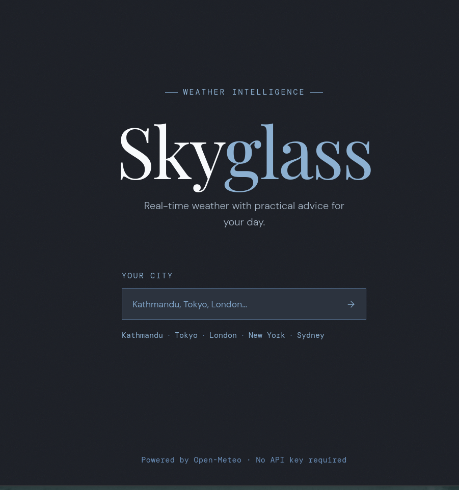
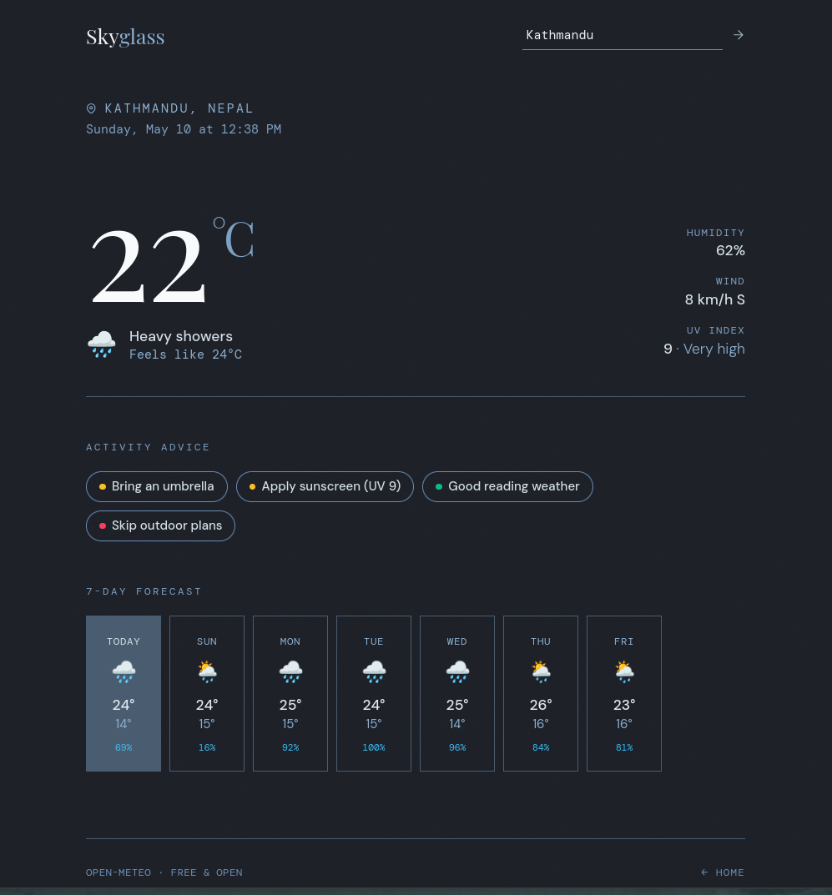

# Weather App

A lightweight Flask-based weather application that provides current conditions, 7-day forecasts, and contextual advice based on real-time weather data.

## Features

- **Current Weather Display** — Real-time temperature, feels-like temperature, humidity, wind speed & direction, and UV index
- **7-Day Forecast** — Daily high/low temperatures with weather conditions and precipitation probability
- **Weather Icons** — Visual emoji indicators for quick condition recognition (☀️ ☁️ 🌧️ ⛈️ ❄️ etc.)
- **Smart Advice** — Context-aware recommendations based on current conditions (e.g., "Bring an umbrella", "Great day for a hike")
- **No API Key Required** — Uses free Open-Meteo API for weather and geocoding data
- **Easy Search** — Simply search by city name to get weather for any location worldwide

## Technology Stack

- **Backend:** Flask (Python)
- **Frontend:** HTML/Jinja2 templates
- **Weather API:** [Open-Meteo](https://open-meteo.com/) (free, open-source)
- **Geocoding:** Open-Meteo Geocoding API

## Screenshots

### Homepage



### Weather Forecast



## Installation

1. Clone the repository:

   ```bash
   git clone <repository-url>
   cd weather_app
   ```

2. Install dependencies:

   ```bash
   pip install -r requirements.txt
   ```

3. Run the application:

   ```bash
   python run.py
   ```

4. Open your browser and navigate to:
   ```
   http://localhost:5000
   ```

## Project Structure

```
weather_app/
├── run.py                 # Application entry point
├── app/
│   ├── __init__.py       # Flask app initialization
│   ├── routes.py         # Route handlers and weather parsing
│   ├── weather_services.py  # Weather and geocoding API calls
│   ├── advice.py         # Weather-based advice generation
│   └── templates/
│       ├── index.html    # Search page
│       └── weather.html  # Weather display page
└── README.md
```

## Usage

1. **Search for a City:** Enter a city name in the search box
2. **View Weather:** The app will display:
   - Current conditions with temperature and "feels like" value
   - Wind speed, direction, and humidity
   - UV index for the current day
   - 7-day weather forecast
   - Contextual advice based on current conditions
3. **Search Again:** Use the search to check weather for different locations

## Advice Categories

The app provides smart, contextual advice:

- ** Warnings** — Umbrella reminders, bundle up alerts, sunscreen recommendations, etc.
- ** Good Ideas** — "Great day for a hike", "Perfect for drying laundry", etc.
- ** Severe** — "Stay indoors" alerts for storms and severe weather

## Weather Codes

The app supports comprehensive WMO weather codes including:

- Clear/cloudy conditions
- Precipitation (drizzle, rain, snow)
- Storms and hail
- Fog conditions

## API Dependencies

- **Weather Forecast:** Open-Meteo Forecast API (lat/lon-based)
- **Geocoding:** Open-Meteo Search API (city name to coordinates)

Both APIs are free with no authentication required.

## License

This project is open source and available for personal and commercial use.
